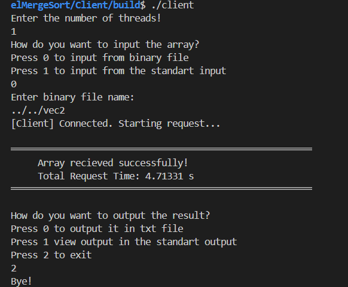
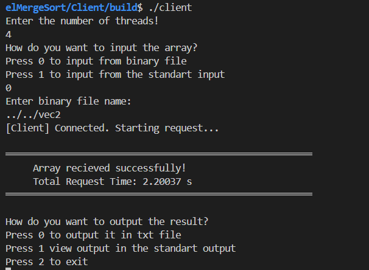

# Parallel Merge Sort Server

Клиент-сървър приложение за разпределено сортиране на големи масиви от данни. Проектът използва **Linux Epoll** за ефективна мрежова комуникация, **Thread Pool** за управление на задачите и **Parallel Merge Sort** за оползотворяване на многоядрени процесори.

## Резултати

Тестовете са проведени с масив от **10 милиона** цели числа (`int`), прочетен от бинарен файл.
CPU: Intel i3-8145U (4) @ 2.304GHz 
| Нишки (Threads) | Време (Total Request Time) | Скорост (Speedup) |
| :---: | :---: | :---: |
| **1** | ~4.71 s | 1.0x (Baseline) |
| **4** | ~2.20 s | **~2.14x Faster** |

*Времето включва: Четене на файл -> Изпращане по мрежата -> Сортиране -> Връщане на резултата -> Запис.*

## Изисквания 

*   **OS:** Linux (заради `sys/epoll`)
*   **Compiler:** GCC / Clang с поддръжка на C++17
*   **Build System:** CMake (версия 3.10+)

## Компилация 

Проектът е разделен на Клиент и Сървър, като всеки има собствена CMake конфигурация.

### 1. Компилиране на Сървъра

```bash
cd Server
mkdir  build
cd build
cmake ..
make
```
### 2. Компилиране на Сървъра

```bash
cd Client
mkdir build
cd build
cmake ..
make
```

### 3. Тестови генератор
В главната директория `generate_random_vec.cpp` след като се компилира, при вход от командия ред име на файл (двоичен) и брой елементи, генерира вектор от цели числа с дадения размер и го записва в дадения файл. Това улеснява тестването с големи масиви.

```bash
g++ generate_random_vec.cpp -o generator.out
./generator.out vec1 1000000
```
### Резултат с 1 нишка:

### Резултат с 4 нишки:


## За повече  детайли, вижте [Documentation.md](Documentation.md).